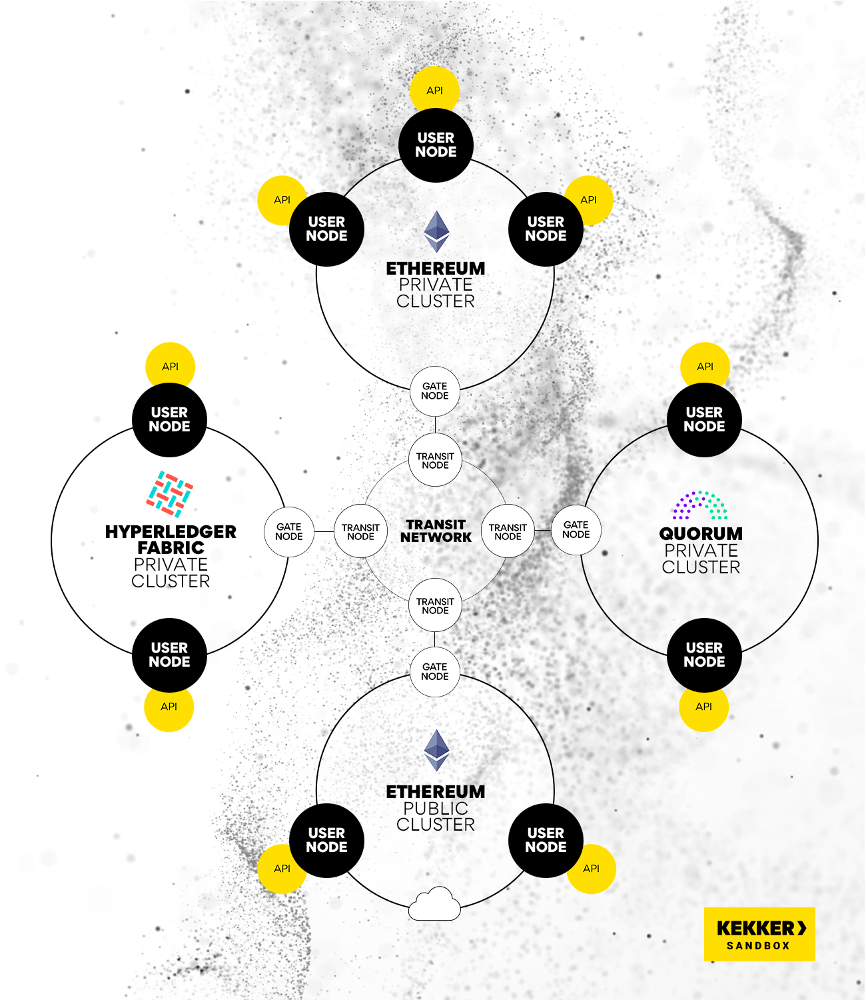
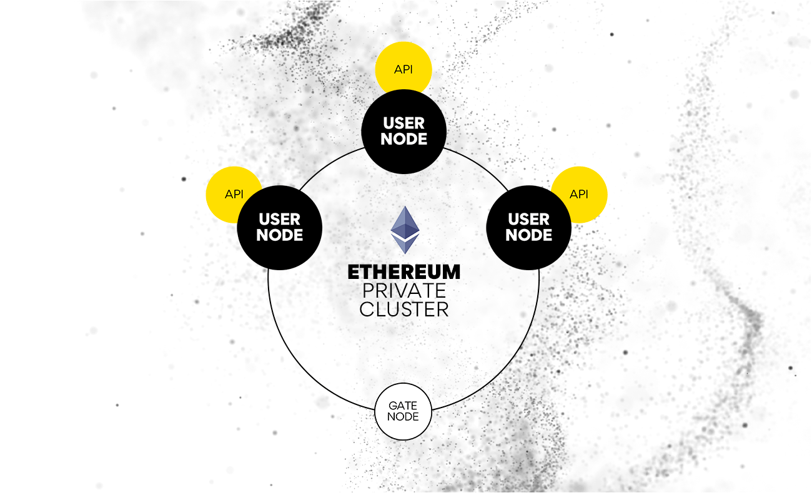
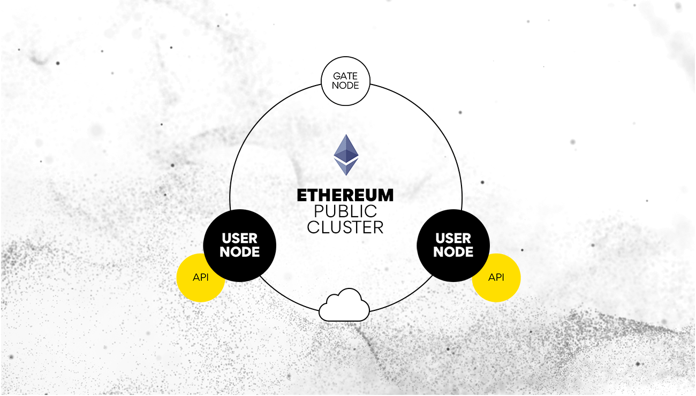
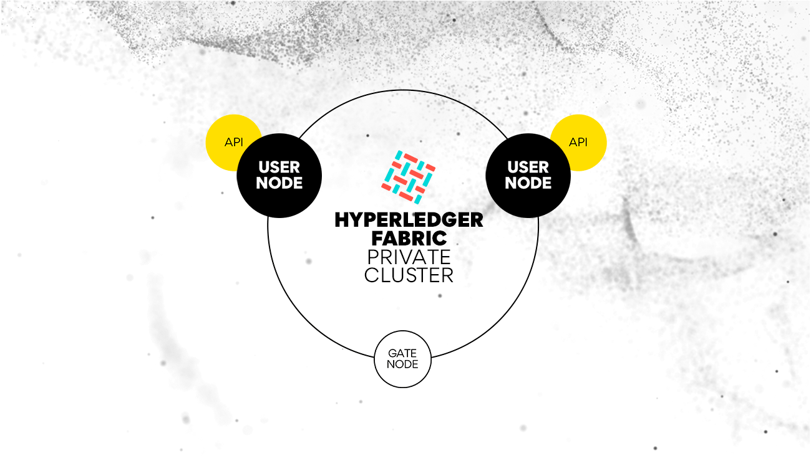
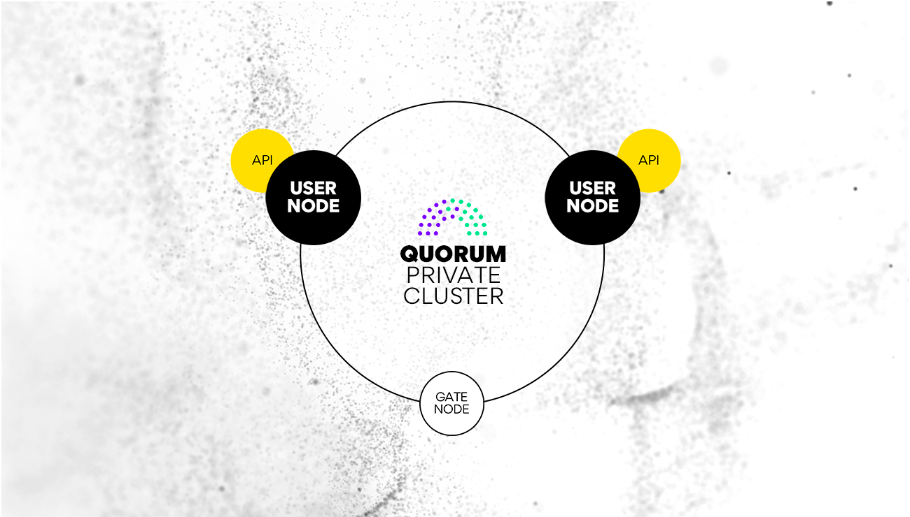

# Sandbox

Kekker Sandbox is free and provides a unique opportunity to build a prototype or MVP 
on any of the popular blockchains. 

As soon as you are ready to launch your business application you can move to 
your own infrastructure or use our commercial infrastructure hosting and supporting services.

#### The Sandbox consists of 4 separate clusters:
* Private Ethereum cluster
* Public Ethereum cluster
* Hyperledger Fabric cluster (limited free availability)
* Quorum cluster (limited free availability)

The clusters interact with each other via a dedicated trunk network.

#### Private Ethereum cluster contains 3 nodes:

* `democlient1.kekker.com`
* `democlient2.kekker.com`
* `democlient3.kekker.com`

#### Public Ethereum cluster is based on the Rinkeby Ethereum testnet and contains 2 nodes:

* `pubdemoclient1.kekker.com`
* `pubdemoclient2.kekker.com`

#### Hyperledger Fabric cluster contains 2 nodes:

* `XXXXX.kekker.com`
* `XXXXX2.kekker.com`

#### Quorum cluster contains 2 nodes:
* `XXXXX.kekker.com`
* `XXXXX2.kekker.com`

### Sandbox Access
Hit the Sandbox Access button, fill out the form and get your access credentials in no time. 

### Transaction timing in Private and Public Networks
Unlike Private Network transactions’ typical processing time of a few minutes, 
transactions in Public Networks may require about 10 minutes to process.

### Differences from production environment
The Sandbox contains test data only and is completely separate from your production environment. 
The Sandbox API URLs clearly state ‘demo’ (e.g., [https://democlient1.kekker.com/]) 
unlike the production environment URLs (e.g., [https://api.kekker.com/]).

> Real commercial data should never be used in the Sandbox.

### Sandbox Benefits 

* **Accelerate release cycles and Save Time and Money** 
   
   Start building your product instantaneously with the DLT/DFS infrastructure you need, 
   helping dev and QA teams increase their efficiency. 
   
   Use Scenarios and well documented API resources to quickly and efficiently speed up 
   the entire development process. Doing so, you will save hundreds of thousands of dollars 
   in man-hours and cut your time-to-market by 6 to 12 months by focusing on building your 
   business application, not the setup and maintenance of your decentralized infrastructure.

* **Scale or move to a blockchain infrastructure tailored to your needs** 
   
   The multi-blockchain environment makes it simple to scale your products up or down as you need them and 
   even move your product to a different blockchain infrastructure.

* **Improve quality and Control spending** 
   
   Avoid DLT/DFS environment configuration drift, so you can produce higher-quality products. 
   Easily clone your Sandbox environment to the production stage, eliminating hardware and cloud sprawl.
